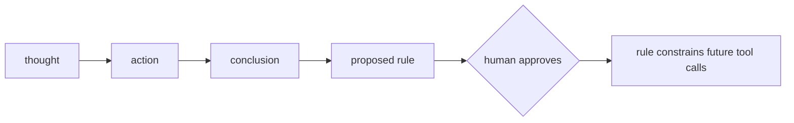
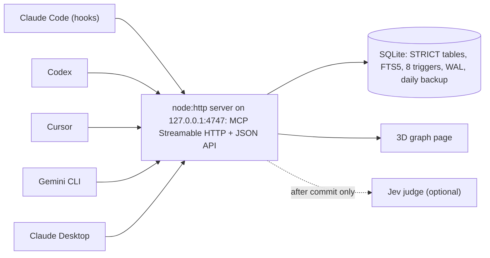

<h1 align="center">🧠 Muse Brain</h1>

<p align="center">
  <em>Your coding agents forget why things were done and repeat mistakes you already fixed. Muse Brain is one shared decision log for Claude Code, Codex, Cursor, Gemini CLI and Claude Desktop: agents are told to check it before they act and record why after (Claude Code does both through hooks), and, in Claude Code, an approved rule with a guard blocks the tool call.</em>
</p>

<p align="center">
  <a href="https://github.com/yahavf6/muse-brain/actions/workflows/test.yml"></a>
  
  
  
  
  
</p>

<p align="center">
  
</p>

[Works with](#works-with) | [Why use it](#why-use-it) | [Quickstart](#quickstart) | [Deploy](#deploy) | [How it compares](#how-it-compares) | [Roadmap](#roadmap)

## Works with

<div align="center">

<table align="center">
  <tr><th colspan="5">On your machine, one-click install</th></tr>
  <tr>
    <td align="center"><a href="#connect-an-agent-one-click"><picture><source media="(prefers-color-scheme: dark)" srcset="https://cdn.jsdelivr.net/npm/@lobehub/icons-static-png@1.97.1/dark/claudecode-color.png"></picture><br><sub>Claude Code</sub></a></td>
    <td align="center"><a href="#connect-an-agent-one-click"><picture><source media="(prefers-color-scheme: dark)" srcset="https://cdn.jsdelivr.net/npm/@lobehub/icons-static-png@1.97.1/dark/claude-color.png"></picture><br><sub>Claude Desktop</sub></a></td>
    <td align="center"><a href="#connect-an-agent-one-click"><picture><source media="(prefers-color-scheme: dark)" srcset="https://cdn.jsdelivr.net/npm/@lobehub/icons-static-png@1.97.1/dark/codex-color.png"></picture><br><sub>Codex CLI + ChatGPT desktop</sub></a></td>
    <td align="center"><a href="#connect-an-agent-one-click"><picture><source media="(prefers-color-scheme: dark)" srcset="https://cdn.jsdelivr.net/npm/@lobehub/icons-static-png@1.97.1/dark/cursor.png"></picture><br><sub>Cursor</sub></a></td>
    <td align="center"><a href="#connect-an-agent-one-click"><picture><source media="(prefers-color-scheme: dark)" srcset="https://cdn.jsdelivr.net/npm/@lobehub/icons-static-png@1.97.1/dark/geminicli-color.png"></picture><br><sub>Gemini CLI</sub></a></td>
  </tr>
</table>

<table align="center">
  <tr><th colspan="3">Cloud agents, via a deployed brain</th></tr>
  <tr>
    <td align="center"><a href="#connect-a-cloud-agent"><picture><source media="(prefers-color-scheme: dark)" srcset="https://cdn.jsdelivr.net/npm/@lobehub/icons-static-png@1.97.1/dark/grok.png"></picture><br><sub>Grok Bot, experimental</sub></a></td>
    <td align="center"><a href="#connect-a-cloud-agent"><picture><source media="(prefers-color-scheme: dark)" srcset="https://cdn.jsdelivr.net/npm/@lobehub/icons-static-png@1.97.1/dark/meta-color.png"></picture><br><sub>Meta Muse, REST connector</sub></a></td>
    <td align="center"><a href="#connect-a-cloud-agent"><picture><source media="(prefers-color-scheme: dark)" srcset="https://cdn.jsdelivr.net/npm/@lobehub/icons-static-png@1.97.1/dark/meta-color.png"></picture><br><sub>Muse Code, MCP</sub></a></td>
  </tr>
</table>

<table align="center">
  <tr><th colspan="8">Model-agnostic: any model behind an MCP client</th></tr>
  <tr>
    <td align="center"><picture><source media="(prefers-color-scheme: dark)" srcset="https://cdn.jsdelivr.net/npm/@lobehub/icons-static-png@1.97.1/dark/claude-color.png"></picture><br><sub>Claude</sub></td>
    <td align="center"><picture><source media="(prefers-color-scheme: dark)" srcset="https://cdn.jsdelivr.net/npm/@lobehub/icons-static-png@1.97.1/dark/openai.png"></picture><br><sub>GPT</sub></td>
    <td align="center"><picture><source media="(prefers-color-scheme: dark)" srcset="https://cdn.jsdelivr.net/npm/@lobehub/icons-static-png@1.97.1/dark/gemini-color.png"></picture><br><sub>Gemini</sub></td>
    <td align="center"><picture><source media="(prefers-color-scheme: dark)" srcset="https://cdn.jsdelivr.net/npm/@lobehub/icons-static-png@1.97.1/dark/grok.png"></picture><br><sub>Grok</sub></td>
    <td align="center"><picture><source media="(prefers-color-scheme: dark)" srcset="https://cdn.jsdelivr.net/npm/@lobehub/icons-static-png@1.97.1/dark/meta-color.png"></picture><br><sub>Llama</sub></td>
    <td align="center"><picture><source media="(prefers-color-scheme: dark)" srcset="https://cdn.jsdelivr.net/npm/@lobehub/icons-static-png@1.97.1/dark/mistral-color.png"></picture><br><sub>Mistral</sub></td>
    <td align="center"><picture><source media="(prefers-color-scheme: dark)" srcset="https://cdn.jsdelivr.net/npm/@lobehub/icons-static-png@1.97.1/dark/deepseek-color.png"></picture><br><sub>DeepSeek</sub></td>
    <td align="center"><picture><source media="(prefers-color-scheme: dark)" srcset="https://cdn.jsdelivr.net/npm/@lobehub/icons-static-png@1.97.1/dark/qwen-color.png"></picture><br><sub>Qwen</sub></td>
  </tr>
</table>

<sub>No model sits in Muse Brain's write path. Agents reach it over MCP (or REST), so the model behind the agent does not matter, and any other MCP Streamable HTTP client can connect the same way. The cloud-agent setups are documented, not yet tested against a live account, and Grok Bot's auth is unsettled (see [Connect a cloud agent](#connect-a-cloud-agent)).</sub>

</div>

## Why use it

| Without it | With it |
|---|---|
| You tell the agent "never touch X". Next session it touches X. CLAUDE.md is a suggestion it can skip. | You approve the rule once, with a guard pattern. Next time an Edit or Write matches it, the Claude Code hook denies the call before it runs. |
| Codex has no idea what Claude decided yesterday. | One graph, every agent. Each row says who wrote it. |
| `git log` says what changed. Not why, not what was rejected. | `ask` returns matching decisions with their why, rejected alternatives and linked outcomes. |
| Decisions ship and nobody checks if they worked. | A conclusion ties the outcome to the action. Actions with no outcome after 14 days get flagged to the agent and in the Needs-you panel. |

**You probably don't need it** if you use one agent, on one small repo, and never switch tools. CLAUDE.md plus git log covers that.

## Your part

After install, almost nothing. The agents do the asking and logging (automatically in Claude Code, by instruction elsewhere).

- **When an agent proposes a rule**, it shows up in the Needs-you panel on the graph page. Click Approve, or say "approve rule 43" in chat. Until then it binds nothing.
- **When a guard blocks something**, the agent sees:
  `Blocked by brain rule #43: Never change a default sort order without an A/B test. Fix the input and retry. If the rule is wrong, tell the human; do not work around it.`
- **When you want to look**, open http://127.0.0.1:4747 (local install): the decisions, who made them, and what came of them.

## The thesis

Memory layers remember what was said. mem0 extracts facts from a conversation into a vector store. Zep and Graphiti build a temporal graph of episodes and entities. claude-mem compresses a coding session into flat observations. All of that is useful, and none of it captures why an agent did something, whether the decision turned out to be right, or what should never be tried again.

Muse Brain is a decision graph, not a memory. It keeps four kinds of node, an assumption, a real action, a rule and a conclusion, and connects them with nine typed edges that SQLite enforces with triggers, not with a prompt. An agent asks the brain before it acts, does the work in the real world, and logs one action with its why. When the outcome becomes known, a conclusion closes the loop back onto the action and onto whatever thought motivated it. A rule an agent proposes binds nothing until a human approves it; from that point it can deny, question, or quietly log a tool call before it runs.



Agents propose, humans approve; no model ever writes the record.

The author ran claude-mem for months before building this. Its store reached 101,485 observations, and because that shape has no outcome edges, not one of them could ever be linked back to the decision it came from. Closing that gap is what this project exists to do.

## Sixty seconds in the brain

Where this ends: an agent tries to edit `defaultSort` and the call is denied, citing a rule a human approved after the last attempt went badly. Here is how it gets there.

An agent is about to touch the dashboard. Before it does, it asks:

```js
ask({ question: "have we decided anything about the dashboard's default sort order before?" })
```

```jsonc
{
  "intent": "history",
  "hits": [
    { "id": 18, "kind": "action", "title": "Changed dashboard default sort from name to most-recent", "status": null, "score": 0.88 },
    { "id": 11, "kind": "thought", "title": "Users miss new items because the dashboard sorts by name", "status": "validated", "score": 0.71 }
  ],
  "expanded": { /* one-hop neighbours of the hits */ },
  "jev": true, // true only with a TYPESAFE_API_KEY
  "footer": [
    "#12 has waited 21 days for an outcome. If you know it, log a conclusion that evaluates it."
  ]
}
```

It does the work, then logs one action with its why, its rejected alternatives, and a link back to what motivated it:

```js
log({
  kind: "action",
  title: "Reverted dashboard default sort back to name",
  why: "most-recent as default did not raise engagement over two weeks and confused returning users, see #18",
  alternatives: ["keep most-recent and add a persistent sort toggle", "A/B test both defaults instead of flipping outright"],
  files: ["apps/web/src/dashboard/SortControl.tsx"],
  links: [{ type: "motivated_by", to: 11 }],
})
```

```json
{
  "id": 41,
  "created": true,
  "links": 1,
  "footer": [
    "#12 has waited 21 days for an outcome. If you know it, log a conclusion that evaluates it.",
    "Possibly related: #18. Link if so."
  ]
}
```

Two weeks later the outcome is known. A conclusion closes the loop and refutes the thought that started it:

```js
log({
  kind: "conclusion",
  title: "Most-recent default did not raise engagement",
  verdict: "bad",
  links: [
    { type: "evaluates", to: 41 },
    { type: "refutes", to: 11 },
  ],
})
```

<p align="center">
  
</p>

The inspector on a refuted thought from the demo seed: status, agent, and its incoming edges. The agent proposes a rule so the mistake is not repeated:

```js
log({
  kind: "rule",
  title: "Never change a default sort order without an A/B test",
  why: "the most-recent default made things worse and nobody noticed for two weeks, see #41",
  status: "proposed",
  guard: { tool: "Edit|Write", deny_if: "defaultSort" },
  links: [{ type: "derived_from", to: 42 }],
})
```

The human, in chat: **"approve rule 43"**. Only then does the agent call:

```js
approve_rule({ id: 43, approved_by: "yahav" })
```

Next session, `SessionStart` injects the approved rule (company-wide here, since it was logged without a `project`), and the next time an `Edit` touches `defaultSort`, `PreToolUse` asks the server and the guard on rule #43 denies the call before it runs.

## What the graph holds

| kind | title is | required | status / verdict | edges out |
|---|---|---|---|---|
| `thought` | an assumption or idea | title | open, validated or refuted; confidence 0 to 1 | `derived_from` a conclusion |
| `action` | what was done in the real world | title, **why** | none | `motivated_by` a thought, `complies_with` a rule, `follows` an action |
| `rule` | one imperative sentence | title, **why** | proposed, approved or retired | `supersedes` a rule, `derived_from` a conclusion |
| `conclusion` | the lesson | title, verdict | good, bad or mixed | `evaluates` an action, `supports` or `refutes` a thought |

A decision is just an action with a why and rejected alternatives on record. Nodes are cited as `#id`, never deleted by agents, only retired (`valid_to` set) when superseded.

Nine legal edges, no others:

| edge | from kind | to kind | means |
|---|---|---|---|
| `derived_from` | thought | conclusion | this thought follows from that conclusion |
| `motivated_by` | action | thought | this action was motivated by that thought |
| `complies_with` | action | rule | this action complies with that approved rule |
| `follows` | action | action | this action follows that one |
| `supersedes` | rule | rule | this rule replaces that one |
| `derived_from` | rule | conclusion | this rule follows from that conclusion |
| `evaluates` | conclusion | action | this conclusion judges that action |
| `supports` | conclusion | thought | this conclusion validates that thought |
| `refutes` | conclusion | thought | this conclusion refutes that thought |

### Enforced by the database, not by prompts

- An edge must match one of the nine legal (type, source kind, destination kind) triples, or the write is rejected.
- `complies_with` only links to an approved, current rule.
- A new rule is always born `proposed`; nothing can insert one already `approved`.
- Approving a rule requires an `approved_by` value.
- `supersedes` retires the old rule only once the new one is itself approved.
- `supports` and `refutes` automatically flip the target thought to `validated` or `refuted`.
- `CHECK` constraints: actions and rules must carry a `why`; conclusions must carry a `verdict`; thought and rule statuses are closed sets.

## Philosophy

1. **Build thin, do not adopt.** gbrain, Basic Memory, Graphiti and mem0 were all evaluated and rejected for this job (ontology mismatch, no binding rules, an LLM on every write, or an AGPL license); their good ideas were kept, their weight was not.
2. **No model in the write path, ever.** Capture is deliberate: the agent logs, the hook nudges. What a model never wrote, a model can never hallucinate into the record.
3. **Invariants live in the store, not in prompts.** Four kinds, nine edges, eight invariant triggers (plus three that keep the FTS index in sync). A prompt can be ignored; a `CHECK` constraint cannot.
4. **Agents propose, humans approve.** A rule binds nothing until a person says so, about that specific rule, in the conversation. Agents can never delete a node or an edge.
5. **Every action carries its why.** A decision without its rejected alternatives is a fact; with them it is knowledge.
6. **Link everything.** Borrowed from gbrain's framing: an unlinked node is a broken brain. The `log` reply warns when a new node leaves with zero edges.
7. **Fail open, always.** If the server is down, hooks exit 0, approved rules still load straight from the database file, and work continues uninterrupted.
8. **One graph, every agent.** Claude Code, Codex, Cursor, Gemini CLI and Claude Desktop write to the same rows, each one stamped with who wrote it; cloud agents can join through a deployed brain (see [Connect a cloud agent](#connect-a-cloud-agent)).
9. **Every visual encodes a fact.** Shape is kind, wireframe is not yet settled, position is time and connection; nothing on the page is decoration.

## How it compares

mem0, Zep and Graphiti, and the rest of the systems below are good, in several cases very good, at conversational recall: reconstructing a fact a user mentioned three sessions ago. Muse Brain does not attempt that job. It assumes an agent will ask before it acts, and it answers with why something was done, what rule constrains it, and what happened afterward, not with a verbatim quote pulled from a chat transcript.

| System | Unit of memory | LLM in write path | Typed edges enforced by store | Human-approved rules bind live tool calls | Outcome tied to the action it judges | Shared across Claude Code / Codex / Cursor / Gemini CLI / Claude Desktop | Storage, runtime deps | License |
|---|---|---|---|---|---|---|---|---|
| **Muse Brain** | 4 typed nodes: thought, action, rule, conclusion | No | Yes, 9 edges, DB triggers | Yes; regex guards deny, semantic guards shadow by default, Claude Code hooks only | Yes, `evaluates` edge | Yes, one MCP server (hooks: Claude Code only) | SQLite, 3 direct dependencies (6 packages installed) | PolyForm Noncommercial |
| mem0 | Flat text facts + vectors | Yes by default[^mem0-1] | Partial, optional graph memory of entities, not enforced[^mem0-2] | No | No, manual feedback API[^mem0-3] | Partial, scoping by `agent_id` / `app_id` | Vector DB, Qdrant default + 20 options | Apache-2.0 |
| Zep / Graphiti | Temporal fact graph: episodes, entities, edges[^zep-1] | Yes, `add_episode` extraction[^zep-2] | Typed by extraction (custom entity and edge types), not enforced by the store | No | No | Partial, group graphs, Zep ABAC | Neo4j / FalkorDB / Neptune (OSS); proprietary (Zep cloud) | Apache-2.0 (Graphiti) |
| Letta | Free-text memory blocks + vector passages | No separate extraction; the agent LLM writes, direct API writes need no LLM[^letta-1] | No, no graph | No, `read_only` blocks only | No | Yes, shared blocks / shared MemFS repos[^letta-2] | Postgres + pgvector; MemFS = git repo per agent | Apache-2.0 |
| claude-mem | Flat typed observation rows | Yes, Agent SDK worker on every `PostToolUse`[^cm-1] | No | No | No | Yes, same DB across harnesses | SQLite + FTS5, optional Chroma | Apache-2.0 |
| Basic Memory | Markdown notes + typed `[[wikilink]]` relations | No server-side LLM, client writes markdown[^bm-1] | Yes, typed relations | Partial, comment / suggestion review, not rules[^bm-2] | No | Yes, teams shared workspace | Markdown files + SQLite / Postgres index | AGPL-3.0 |
| gbrain | Typed pages + typed edges with provenance | No for edges; optional for extraction[^gb-1] | Yes | Partial, owner-approved OAuth, no rule queue | Partial, nightly dream cycle + contradiction eval[^gb-2] | Yes, scoped tokens, company-brain mode | Markdown repos + PGLite or Postgres + pgvector | MIT |
| Cognee | LLM-extracted knowledge graph + vectors | Yes, `cognify()`[^cog-1] | Yes, incl. `contradicts` edges | No | Partial, 1 to 5 feedback weights[^cog-2] | Partial, shared datasets and tenants | Kuzu + LanceDB + SQLite | Apache-2.0 |
| Supermemory | Temporal fact graph: updates / extends / derives | Yes, async extraction queue[^sm-1] | Yes | Partial, review queue for low-confidence inferred memories, not rules[^sm-2] | No | Yes, shared `containerTag` | Cloudflare Workers + Postgres / pgvector | MIT (repo); local binary capped at 10k docs[^sm-3] |
| Honcho | Peer representations: premises + conclusions | Yes, after the request commits[^ho-1] | No entity graph | No | No | Yes, native multi-peer | Postgres + pgvector, Redis | AGPL-3.0 |

[^mem0-1]: `infer=False` bypasses extraction; on by default. https://docs.mem0.ai/core-concepts/memory-operations/add
[^mem0-2]: Graph memory overview. https://docs.mem0.ai/open-source/graph_memory/overview
[^mem0-3]: Platform `feedback` API, manual. https://docs.mem0.ai/platform/features/feedback-mechanism
[^zep-1]: Bi-temporal context graph, Graphiti paper. https://arxiv.org/abs/2501.13956
[^zep-2]: `add_episode` runs LLM extraction. https://help.getzep.com/graphiti/configuration/llm-configuration
[^letta-1]: Direct archival-memory API writes need no LLM. https://docs.letta.com/guides/agents/archival-memory
[^letta-2]: MemFS, a git repo per agent. https://docs.letta.com/concepts/memfs
[^cm-1]: Architecture overview. https://docs.claude-mem.ai/architecture/overview
[^bm-1]: Knowledge format: notes + typed relations. https://docs.basicmemory.com/raw/concepts/knowledge-format.md
[^bm-2]: Comments and suggestions review. https://docs.basicmemory.com/raw/cloud/comments-and-suggestions.md
[^gb-1]: "Zero LLM calls" for edges; optional extraction. https://github.com/garrytan/gbrain#readme
[^gb-2]: Nightly dream cycle + contradiction eval. https://github.com/garrytan/gbrain-evals
[^cog-1]: `cognify()` calls an LLM. https://docs.cognee.ai/core-concepts/main-operations/cognify
[^cog-2]: `add_feedback` 1 to 5 updates `feedback_weight`. https://docs.cognee.ai/guides/feedback-system
[^sm-1]: Extracting, Chunking, Embedding queue. https://supermemory.ai/docs/how-it-works
[^sm-2]: Inferred-memory review, approve or decline. https://supermemory.ai/docs/recall/memory-review.md
[^sm-3]: Local server release notes. https://github.com/supermemoryai/supermemory/releases/tag/server-v0.0.7
[^ho-1]: The request never waits on an LLM; the deriver runs after. https://docs.honcho.dev/v3/documentation/core-concepts/architecture

### Measured

Synthetic decision graphs written through the real `log` verb (zod validation, `BEGIN IMMEDIATE`, content hash, FTS triggers, edge triggers, reply footer), then 200 samples of each read verb. Jev was off for this run, so no network round trip; with a `TYPESAFE_API_KEY` set, `log` and `ask` each add one Jev call, up to 1.5 s and 2.5 s budgets respectively. Latencies in milliseconds. Full notes in [`bench/results-2026-09-22.md`](bench/results-2026-09-22.md).

| Nodes | log p50 | log p95 | writes/s | ask p50 | ask p95 | search p50 | context p50 | get p50 | DB MB | cold open |
|---|---|---|---|---|---|---|---|---|---|---|
| 1,000 | 0.17 | 0.26 | 5,067 | 0.37 | 0.56 | 0.12 | 0.08 | 0.03 | 0.7 | 0.41 |
| 10,000 | 0.17 | 0.27 | 4,720 | 1.23 | 3.02 | 0.67 | 0.10 | 0.03 | 6.3 | 0.45 |
| 100,000 | 0.18 | 0.28 | 3,818 | 9.51 | 27.0 | 7.48 | 0.11 | 0.03 | 64.3 | 0.53 |

Hook overhead (`PreToolUse` end to end, bash plus jq plus curl to the live server, 20 runs): p50 238 ms, p95 266 ms.

`context` and `get` stay flat because they are index walks from a known id. Every write still pays for zod validation, the transaction, the content-hash lookup, FTS index maintenance and the indexed outcome-gate lookup. Writing the bench caught and fixed two real bugs: the outcome-gate query and the Needs-you query both used `julianday()` arithmetic SQLite could not index, a full table scan per call, now a partial index; and link-suggestion candidates were computed even when Jev was off, now skipped.

Machine: Apple M4 Pro, 48 GB, macOS 26.6.2, Node 24.11.1, 2026-09-22. Reproduce with `npm run bench` (1k / 10k / 100k by default; 1M via `BENCH_SIZES`, expect hours).

### Why there is no LoCoMo score here

Muse Brain is a decision graph, not a chat-recall system, so LoCoMo and LongMemEval measure something it does not attempt: reconstructing facts from a long conversation. Those benchmarks also have real problems. [An independent audit](https://github.com/dial481/locomo-audit) found 6.4% of LoCoMo's golden answers corrupted, capping any system near 93.6%. [Judge choice alone swings identical answers from 32% to 84%](https://github.com/MemPalace/mempalace/issues/29). [mem0 and Zep have disputed each other's LoCoMo numbers for over a year](https://github.com/getzep/zep-papers/issues/5), still unresolved. And [a third-party, cost-aware run](https://arxiv.org/html/2601.07978v4) found plain RAG at $0.65 beating two graph-based systems that cost several times more; the same run had mem0 at 81.08% above the RAG baseline's 78.31%, so the point is cost and variance, not that graphs lose. None of that says graph memory is bad; it says a recall leaderboard is not the yardstick for a system built to hold why, not what was said.

<details>
<summary>Published recall numbers of the systems above</summary>

| System | LoCoMo | LongMemEval | Notes |
|---|---|---|---|
| mem0 | [Self-reported](https://arxiv.org/abs/2504.19413): 66.88 to 68.44 (gpt-4o-mini)<br>[Self-reported](https://mem0.ai/blog/mem0-the-token-efficient-memory-algorithm): 92.5 (2026, model/judge undisclosed)<br>[Third-party](https://arxiv.org/html/2601.07978v4): 81.08% at $5.43 (plain RAG baseline: 78.31% at $0.65) | [Self-reported](https://mem0.ai/blog/mem0-the-token-efficient-memory-algorithm): 94.4 (2026)<br>[Third-party](https://agentmemorybenchmark.ai/dataset/longmemeval): 67.6% GPT-4o | [Third-party](https://arxiv.org/abs/2602.01313) EverMemBench 37.09%; paper search p50 0.148s, ~7k tokens/conv |
| Zep / Graphiti | [Self-reported](https://blog.getzep.com/lies-damn-lies-statistics-is-mem0-really-sota-in-agent-memory/): 75.14%<br>[Self-reported](https://www.getzep.com/research/): 94.7% (gpt-5.4 reader+judge, 2026, no code linked)<br>[Third-party](https://arxiv.org/html/2601.07978v4): OSS Graphiti 56.03% at $6.95 | [Self-reported](https://arxiv.org/abs/2501.13956): 71.2% gpt-4o vs 60.2% full-context<br>[Self-reported](https://www.getzep.com/research/): 90.2% gpt-5.4 (2026) | [Third-party](https://arxiv.org/abs/2602.01313) EverMemBench 39.97%; 2026 p50/p95 87ms/155ms |
| Letta | [Self-reported](https://www.letta.com/blog/benchmarking-ai-agent-memory/): 74.0% (gpt-4o-mini, filesystem tools only) | none found | [Self-reported](https://arxiv.org/abs/2310.08560) DMR 93.4% GPT-4-turbo, a near-saturated benchmark |
| claude-mem | none found | none found | |
| Basic Memory | [Self-reported](https://github.com/basicmachines-co/basic-memory-benchmarks/blob/main/benchmarks/results/matrix-v2-summary.md): QA 0.439 to 0.641 (q300 subset) | [Self-reported](https://github.com/basicmachines-co/basic-memory-benchmarks/blob/main/benchmarks/results/matrix-v2-summary.md): QA 0.583 vs mem0-local 0.450 (60-q subset) | |
| gbrain | none found | [Self-reported](https://github.com/garrytan/gbrain-evals/blob/main/docs/benchmarks/2026-09-06-longmemeval-ranker-wave.md): QA 86.6% with reader (2026) | [Third-party](https://github.com/tenurehq/precisionMemBench) PrecisionMemBench 34/77 pass, p50 544ms |
| Cognee | [Third-party](https://arxiv.org/html/2601.07978v4): 55.27% at $2.99<br>[Third-party](https://agentmemorybenchmark.ai/dataset/locomo): AMB 80.3% on 152 queries | none found | |
| Supermemory | [Self-reported](https://github.com/supermemoryai/supermemory/issues/795): 77.1 (GPT-4o, reported in a GitHub issue) | [Self-reported](https://supermemory.ai/research/longmembench/): 95% (Recall@15, not QA); judged 84.6% gpt-5<br>[Third-party](https://arxiv.org/abs/2512.12818): 81.6% | |
| Honcho | [Self-reported](https://plasticlabs.ai/blog/research/Benchmarking-Honcho): 89.9% (Claude Haiku 4.5, judge undisclosed) | [Self-reported](https://plasticlabs.ai/blog/research/Benchmarking-Honcho): 90.4% (Haiku 4.5) | |

Every headline number above is vendor-run on a vendor-chosen model and judge stack unless marked third-party. `agentmemorybenchmark.ai` is operated by Vectorize, the vendor of a competing product (Hindsight).

</details>

## Architecture



### Verbs (8 over MCP + the JSON API, 4 UI-only)

| verb | what | exposed |
|---|---|---|
| `ask` | plain-language question; ranked `#id` hits plus one-hop context | MCP + API |
| `search` | structured lookup by kind, status, verdict, project, optional full-text | MCP + API |
| `context` | the neighborhood of a node, up to N hops, capped at 25 nodes | MCP + API |
| `get` | one or more nodes by id, with their edges | MCP + API |
| `log` | write a node with why, props, links; returns id, created flag, footer | MCP + API |
| `link` | add a typed edge between two existing nodes | MCP + API |
| `update` | change title, why, status, confidence, props or project with a `rev` check (verdict and guard are admin-only) | MCP + API |
| `approve_rule` | proposed to approved, with `approved_by`; only after a human said so | MCP + API |
| `delete_node`, `delete_edge` | hard delete | UI only, never an MCP tool; agents cannot delete |
| `agent_policies` | every known agent's read/write/project policy, plus the distinct project names | UI only |
| `set_agent_policy` | upsert one agent's read/write toggles and project scope (`null` = all projects) | UI only |

The 8 non-UI verbs are also `POST /api/v1/<verb>` (REST, same `callVerb()` path), with an OpenAPI 3.1 document at `/api/v1/openapi.json` generated from the same table.

### Hooks (Claude Code only, everything fails open with exit 0)

| hook | mode | does |
|---|---|---|
| `SessionStart` | `start` | injects approved rules scoped to this repo, reads the DB directly, works with the server down |
| `UserPromptSubmit` | `recall` | up to 3 related `#id` lines for the prompt, silent when nothing matches |
| `PreToolUse` | `pre` | one call to the server: regex guards, then semantic guards, then file-touch advice; deny, ask or allow |
| `PostToolUse` | `mark` | notes that a real-world call happened (commit, send, deploy, `mcp__*`) so `Stop` can nudge once |
| `Stop` | `stop` | nudges exactly once per session to `log` the action with its why |

`bash hooks/brain-hook.sh --selftest` runs fixtures for `start`, `pre`, `mark` and `stop`. The `curl` itself runs in well under a millisecond on loopback; the hook invocation is dominated by process spawn (bash, jq, curl), see the bench table above.

> **Jev**, the optional judge (TypeSafe System One), only decorates replies after a write has already committed: `ask` ranking, recall rerank, semantic guards, link suggestions. It returns `null` on a missing key, a timeout, a non-2xx response or bad JSON, and never throws and never blocks the commit; the `log` reply does wait up to 1.5 s for link suggestions when a key is set. Without `TYPESAFE_API_KEY` everything still works off FTS5 and bm25.

## Quickstart

### One-command install

```bash
curl -fsSL https://raw.githubusercontent.com/yahavf6/muse-brain/main/install.sh | bash
```

Preflights `git`/`curl`/`sqlite3`/`jq`/`node>=24` (offers `brew install` for a missing `jq` or `node`), clones or updates `~/.muse-brain` (override `MUSE_BRAIN_DIR`/`MUSE_BRAIN_REPO`), runs `npm ci`, installs the macOS launchd service (`--no-service` to skip; Linux prints manual `npm start` guidance instead), then runs the connect wizard (`node src/setup.ts`, also reachable as `npm run setup` from inside a checkout). The wizard detects which of the 5 clients are on this machine and, with one `Enter`, connects all of them with read + write access on every project -- or walks each one's access individually. A shortened, illustrative run:

```
Server: reachable at http://127.0.0.1:4747 (52 nodes, 2 agents seen).

Claude Code: found, not connected
Codex CLI + ChatGPT desktop: found, not connected

Connect the 2 found agent(s) with read + write on all projects? [Y/n]
Claude Code: 3 file(s) written, 1 backup(s).
Codex CLI + ChatGPT desktop: 3 file(s) written.

Files changed: /Users/you/.claude.json, /Users/you/.claude/settings.json, /Users/you/.claude/skills/brain, /Users/you/.codex/config.toml, /Users/you/.codex/AGENTS.md, /Users/you/.agents/skills/brain
Backups: /Users/you/.claude.json.bak-brain-20260923-101500
Start a new session in each connected agent for changes to take effect.
See http://127.0.0.1:4747/ -- Connect agent panel -- to change access later.
```

Answering `n` instead walks each detected client one at a time, asking `<name>: access -- [RW] read+write, r = read-only, s = skip (no access)` and, for anything but skip, `<name>: projects -- Enter for all, or a comma-separated list` -- see "Control what each agent reads and writes" below.

### Requirements

- macOS for the background service (`launchd`); the server itself runs anywhere Node 24 does
- Node >= 24 on `PATH` (`node:sqlite`, type stripping, `process.loadEnvFile`)
- `sqlite3`, `jq`, `curl` on `PATH`

### Run it, by hand

Skip the script above and do each step yourself:

```bash
git clone https://github.com/yahavf6/muse-brain.git && cd muse-brain
npm install
npm start
```

Open `http://127.0.0.1:4747`. `npm start` runs `src/server.ts` directly: no build step. Then wire up an agent below, or run the wizard yourself with `npm run setup`.

### See it with data

```bash
npm run seed
```

Writes a fictional B2B SaaS story ("Lumen"): a pricing toggle, an email queue migration, an onboarding wizard, API rate limits, a support auto-reply. 52 nodes, 51 edges, all nine edge types, two rules left `proposed` so the Needs-you panel has something to approve, everything scoped `project: 'demo'` so it can never bind real work. Refuses to run against a non-empty database; pass `--force` to seed anyway, or point it at a scratch file instead: `BRAIN_DB=/tmp/mb-demo.db npm run seed`.

### Connect an agent, one click

The wizard above (`npm run setup`) already does this for every detected client. To add one later, or straight from the page: open it, click **Connect agent**, then **Install** next to a client. It writes that client's MCP config file (Claude Code's `~/.claude.json`, Codex's `~/.codex/config.toml`, Cursor's `~/.cursor/mcp.json`, Gemini CLI's `~/.gemini/settings.json`, Claude Desktop's config via `mcp-remote`). For Claude Code it also writes the five hook groups into `~/.claude/settings.json` and a `~/.claude/skills/brain` symlink. For Codex it also writes a `~/.agents/skills/brain` symlink and a short "Company brain" block appended to `~/.codex/AGENTS.md`. For Gemini CLI it also appends that same block to `~/.gemini/GEMINI.md`. It backs up any file it touches first as `<file>.bak-brain-<timestamp>`. A client that is already wired up is left untouched: no write, no backup.

### Connect an agent, by hand

Same wiring, run yourself. The server name must stay `brain` (a hook regex depends on it); each client points at `http://127.0.0.1:4747/mcp?agent=<name>`.

**Claude Code**
```bash
claude mcp add --scope user --transport http brain "http://127.0.0.1:4747/mcp?agent=claude-code"
```

**Codex CLI + ChatGPT desktop**, add to `~/.codex/config.toml`:
```toml
[mcp_servers.brain]
url = "http://127.0.0.1:4747/mcp?agent=codex"
```

**Cursor**, add to `~/.cursor/mcp.json`:
```json
{ "mcpServers": { "brain": { "url": "http://127.0.0.1:4747/mcp?agent=cursor" } } }
```

**Gemini CLI**, add to `~/.gemini/settings.json`:
```json
{ "mcpServers": { "brain": { "url": "http://127.0.0.1:4747/mcp?agent=gemini-cli", "type": "http" } } }
```
Verify these two key names against current Cursor and Gemini CLI docs before relying on them: they move.

**Claude Desktop**, no native HTTP MCP support, bridged through `mcp-remote`:
```json
{ "mcpServers": { "brain": { "command": "npx", "args": ["mcp-remote", "http://127.0.0.1:4747/mcp?agent=claude-desktop"] } } }
```

### Connect a cloud agent

These agents run in a vendor's cloud, so they reach a deployed brain's public listener (see [Deploy](#deploy)), never `127.0.0.1`. Mint one token per agent first, and use `https://<your-brain-host>` for your deployment's public HTTPS URL (MCP is that URL plus `/mcp`). On the public listener identity is the token's agent name and a `?agent=` query param does nothing. The product details below are as reported by vendor docs and forums when checked on 2026-09-23; none of it was tested against a live account, and these products change fast.

**Grok Bot** (SpaceXAI + Cursor, beta since 2026-08-11; not the @grok account on X or grok.com). Bots run on a persistent per-user cloud VM. Tell a Bot in chat: `Add this MCP server: https://<your-brain-host>/mcp`. Some versions have no dedicated settings form for this. Tools appear on the next message, the server then shows under Settings > Plugins > Yours, and you attach it in a chat with `@`. The server must be reachable over the public internet (Streamable HTTP or SSE); localhost does not work. Sources: [Cursor forum: GrokBot custom connectors](https://forum.cursor.com/t/grokbot-custom-connectors/169965), [xAI docs: computer and apps](https://docs.x.ai/grok-bot/computer-and-apps).

Auth is unsettled. Third-party guides describe passing an API key as a custom header when adding the server, so the bearer header (`Authorization: Bearer <token>`) is worth trying; verify it works for you. But a Cursor staff reply dated 2026-09-17 says Grok Bot connectors currently authenticate only via OAuth and that there is no secure place to enter a header secret, not via chat and not via model-visible tool arguments ([source](https://forum.cursor.com/t/grok-bot-custom-mcp-oauth-fails-before-sign-in-redirect-uri-not-allowed/171877)). Muse Brain has bearer tokens only, no OAuth server (see Roadmap), so if Grok Bot stays OAuth-only, OAuth support is the fix and the header path may not work at all. A token you hand a Bot through chat is visible to the model and to the transcript: mint a dedicated token for that Bot, prefer `--read-only`, and revoke it on any doubt. Enterprise Cursor teams can enforce an MCP allowlist; the server URL must be on it.

**Meta Muse** (Meta's consumer personal agent, launched 2026-09-08; runs on Muse Secure VM, where Sentinel approves network egress and connector actions). It has no MCP support. It connects through Connectors: Meta-reviewed directory ones (developers submit at muse.ai/platform; Meta has published no SDK, fees or terms), or a Custom Connector that Muse writes itself when you ask. Meta's help center says "you can ask Muse to create a Custom Connector" and that this "can involve retrieving API information from the service"; credentials go in its Secure Credentials Store, and Meta does not review custom connectors. Sources: [Meta help center](https://www.meta.com/help/artificial-intelligence/1687253048996149/), [Meta research blog on Muse security](https://research.meta.ai/blog/security-and-safety-for-ai-agents-our-approach-with-muse).

Muse Brain gives such a connector what it needs: `POST /api/v1/<verb>` for the 8 non-UI verbs and an OpenAPI 3.1 document at `/api/v1/openapi.json`. The recipe below is what third-party vendors report working; Meta documents only the general Custom Connector flow.

1. Point Muse at [`docs/muse-connector-brief.md`](docs/muse-connector-brief.md), by the raw GitHub URL of your copy of the repo (for the upstream repo, `https://raw.githubusercontent.com/yahavf6/muse-brain/main/docs/muse-connector-brief.md`), or paste its contents into the chat, and ask Muse to build a Custom Connector from it.
2. The brief has two placeholders, `<your-brain-url>` and `<your-token>`, and tells Muse to ask you for both rather than invent them. Give it the token when it asks (a dedicated one, `--read-only` unless you want Muse to write).
3. Approve the destination when Sentinel asks.

**Muse Code** (Meta's separate terminal coding agent, not the Muse app) speaks ordinary MCP. In `~/.config/muse/settings.json` (merge into the existing file if there is one), which must contain `"schema_version": 1`:

```json
{
  "schema_version": 1,
  "mcp_servers": {
    "brain": {
      "transport": "streamable_http",
      "url": "https://<your-brain-host>/mcp",
      "headers": { "Authorization": "Bearer <token>" },
      "mode": "optional"
    }
  }
}
```

MCP servers are not sandboxed there. Source: [Muse Code, extending](https://dev.meta.ai/docs/muse-code/extending).

### Control what each agent reads and writes

Every agent is unrestricted by default: no row for it in the `agent_policy` table means read + write on every project, exactly the behavior every install had before this feature existed. To narrow one down, use the wizard (`npm run setup`) or the **Connect agent** panel's per-agent Read/Write and project chips -- both end up calling the same `set_agent_policy` verb, which upserts one row: `can_read`, `can_write`, and `projects` (`NULL` = every project, a JSON array = only those). A node with no `project` (company-wide) is always visible to a scoped agent's reads; a scoped agent can never *write* one, only its own listed projects.

Enforcement happens in exactly one place, `callVerb()` in `src/verbs.ts`, and only for MCP and REST callers (`scope: 'full'`); the UI's `POST /api/call` runs `scope: 'admin'` and bypasses agent policy entirely, same as it bypasses every other `full`-only rule. A refused read verb (`ask`, `search`, `context`, `get`) or write verb (`log`, `link`, `update`, `approve_rule`) gets back exactly this message (`<agent>` is the caller's `?agent=` name on the loopback listener, or the token's agent name on the public one):

```
<agent> has no read access to the brain; the human can change this in Connect agent
<agent> has no write access to the brain; the human can change this in Connect agent
```

A scoped agent's write outside its allowed projects instead gets:

```
<agent> may only write to: <project>, <project>
```

MCP tool registration mirrors this (`mcpServerFor(who)` in `src/server.ts`, a fresh server built for each `/mcp` request): a read-only agent's tool list simply omits `log`/`link`/`update`/`approve_rule`. That's cosmetic on top of the refusal above, not a second enforcement point -- a client that calls a hidden tool by name anyway still gets refused in `callVerb()`.

Identity behind all of this is still just the self-declared `?agent=` query param on the loopback listener (see "Status and limits" below): this policy is a well-behaved-agent guardrail, not a security boundary. Any local process can call the MCP endpoint under whatever agent name it likes, or open `~/.brain/brain.db` directly with `sqlite3`. (On the public listener identity is the bearer token's agent name instead, and the policy row is keyed by that name; `--read-only` on a token is how a cloud agent gets restricted, see Deploy.)

### Claude Code hooks

Back up `~/.claude/settings.json` first. **Append** these to the arrays under `"hooks"`, do not replace what is already there:

```json
{
  "hooks": {
    "SessionStart": [{ "hooks": [{ "type": "command", "command": "bash <repo>/hooks/brain-hook.sh start", "timeout": 5 }] }],
    "UserPromptSubmit": [{ "hooks": [{ "type": "command", "command": "bash <repo>/hooks/brain-hook.sh recall", "timeout": 5 }] }],
    "PreToolUse": [{ "matcher": "Bash|Edit|Write|MultiEdit|NotebookEdit|mcp__.*", "hooks": [{ "type": "command", "command": "bash <repo>/hooks/brain-hook.sh pre", "timeout": 5 }] }],
    "PostToolUse": [{ "matcher": "Bash|mcp__.*", "hooks": [{ "type": "command", "command": "bash <repo>/hooks/brain-hook.sh mark", "timeout": 5 }] }],
    "Stop": [{ "hooks": [{ "type": "command", "command": "bash <repo>/hooks/brain-hook.sh stop", "timeout": 5 }] }]
  }
}
```

Replace `<repo>` with the path you cloned into. Hooks for Codex, Cursor and Gemini CLI are on the roadmap; today those agents get the MCP tools and the skill below, no hooks.

### Skill, all agents

```bash
ln -s <repo>/skills/brain ~/.claude/skills/brain
ln -s <repo>/skills/brain ~/.agents/skills/brain
```

For agents without hooks (Codex, Gemini CLI, Cursor), add this pointer to `~/.codex/AGENTS.md` and `~/.gemini/GEMINI.md`:

```
Muse Brain (MCP server `brain`) is this machine's shared decision log. Before a task or any outbound or irreversible call, call `ask`; after real-world work, call `log` once with kind=action and a why.
Approved rules bind you: call `search(kind: rule, status: approved)` at the start of a session and obey what comes back.
See the `brain` skill for the 4 node kinds, the edge vocabulary, and worked `log` examples.
```

### Always-on service

```bash
bash scripts/service.sh install     # renders the plist with your node + repo paths, bootstraps and starts it
bash scripts/service.sh status      # launchctl print, plus a version check
bash scripts/service.sh restart
bash scripts/service.sh uninstall
```

Label is `ai.musebrain.brain`. `render` prints the plist without installing it, useful for checking what it will write.

### Env file

`~/.brain/.env`, `chmod 600`, loaded automatically at server start:

```
TYPESAFE_API_KEY=sk-...      # optional; absent = Jev off, FTS only
BRAIN_JEV=off                # disable Jev while keeping a key
BRAIN_JEV_GUARDS=shadow      # shadow | on | off
BRAIN_GUARDS=off             # kill switch for all guards
```

Also read, from this file or the process environment (a variable already set in the environment wins over the file):

| variable | default | meaning |
|---|---|---|
| `BRAIN_PORT` | `4747` | the loopback listener, always on, `127.0.0.1` |
| `BRAIN_PUBLIC_PORT` | unset (off) | opens the public listener on this port; must differ from `BRAIN_PORT`; empty or unset means off, anything invalid stops the server at startup (see Deploy) |
| `BRAIN_HOST` | `0.0.0.0` | the address the public listener binds; `127.0.0.1` keeps it behind a same-machine tunnel or proxy |
| `BRAIN_DB` | `~/.brain/brain.db` | the database; the daily snapshots go to `backups/` next to it |
| `BRAIN_LOG_DIR` | `~/.brain/logs` | the server's `server.log` and `guard.log` (the hook always logs to `~/.brain/logs`) |
| `BRAIN_TOKENS_FILE` | `~/.brain/tokens.json` | the bearer-token store, read by the public listener and by `npm run token` |

## Deploy

Muse Brain also runs as a container, so it can serve every agent on a team instead of just the machine it's installed on. It is still one process, now with two listeners:

- **Loopback listener**: `BRAIN_PORT` (default 4747) on `127.0.0.1`, always on. It is exactly what runs on your machine: every route (the graph page, `/api/call`, `/api/install`, `/api/recall`, `/api/pre`), Host/Origin validation, `?agent=` identity. Public mode does not touch it, so local agents, hooks, the graph page and the installer keep working unchanged.
- **Public listener**: only when `BRAIN_PUBLIC_PORT` is set (empty or unset means off; it must differ from `BRAIN_PORT`, and an invalid value stops the server at startup). It binds `BRAIN_HOST` (default `0.0.0.0`) and serves only `/mcp`, `POST /api/v1/<verb>` and `GET /api/v1/openapi.json`. Everything else answers `404` there before any processing, whatever the headers. Identity is `Authorization: Bearer <token>` only (a missing or invalid token gets `401` with `WWW-Authenticate: Bearer`), and `?agent=` is ignored.

The image sets `BRAIN_PORT=4748` and `BRAIN_PUBLIC_PORT=4747`: the public listener takes the one exposed port, and the loopback listener stays inside the container. The public listener speaks plain HTTP on that port, so TLS has to come from the platform or a proxy in front.

### Fly.io

```bash
fly launch --ha=false
```

Run from a clone of this repo. `fly launch` picks up the repo's `Dockerfile` and `fly.toml` automatically -- the `brain_data` volume, the `BRAIN_DB`/`BRAIN_LOG_DIR`/`BRAIN_PORT`/`BRAIN_PUBLIC_PORT`/`BRAIN_TOKENS_FILE` env vars, the HTTP service on port 4747 with forced HTTPS, and an HTTP health check on `GET /api/v1/openapi.json` are all already in `fly.toml`. Answer the prompts (or `fly deploy` on subsequent pushes) and the DB, the logs, the tokens file and the daily backups persist across deploys on the mounted volume.

Two things to do by hand. `app = "muse-brain"` in `fly.toml` must become a name nobody else has (or let `fly launch` rename it). And keep exactly one machine: a Fly volume pins the app to one machine in one region, and a second machine would get its own empty volume, so its own empty database and its own tokens (`fly launch --ha=false` above, `fly scale count 1` if a second one ever appears).

Mint a token for each agent (see [Tokens](#tokens)):

```bash
fly ssh console -C "sh -c 'cd /app && npm run token -- mint grok-bot'"
```

### DigitalOcean

Create a Droplet from the **Docker on Ubuntu** Marketplace image with a Volume attached, mount the volume at `/mnt/brain_data`, and paste [`.do-marketplace/cloud-init.yaml`](.do-marketplace/cloud-init.yaml) into the Droplet's **User Data** field at creation time -- it starts the container with the volume and env vars wired up. Or skip User Data and SSH in once the Droplet is up to run the same `docker run` line by hand. The cloud-init refuses to start the container if nothing is mounted at `/mnt/brain_data`, so the data can never silently land on the Droplet's root disk.

This is a Droplet, not the "Deploy to DO" App Platform button, because App Platform's disk is ephemeral and would wipe the database on every redeploy.

Nothing in the cloud-init terminates TLS, so it publishes the container on the Droplet's loopback only (`-p 127.0.0.1:4747:4747`): nothing is reachable from the internet, and no token crosses it in cleartext, until you put a TLS proxy on the Droplet in front of `127.0.0.1:4747`. With Caddy, which fetches certificates itself (the name needs a DNS record pointing at the Droplet, and ports 80 and 443 open in its firewall):

```bash
caddy reverse-proxy --from brain.example.com --to 127.0.0.1:4747
```

Agents then use `https://brain.example.com/mcp`. Any proxy works, nginx included: the public listener never consults forwarded headers or `Host`. If you would rather publish the port directly, change the cloud-init to `-p 4747:4747`; tokens then travel in cleartext until TLS is added, so restrict who can reach the port with a DigitalOcean Cloud Firewall. The cloud-init also pulls `ghcr.io/yahavf6/muse-brain:latest`, which no CI job publishes yet: build and push the image yourself, or point the `docker run` line at a locally built tag.

Mint a token for each agent (see [Tokens](#tokens)):

```bash
docker exec muse-brain npm run token -- mint grok-bot
```

### From your Mac

No hosting needed: the local service can open a public listener too. Add these to `~/.brain/.env` (the server loads that file at startup; see [Env file](#env-file)):

```
BRAIN_PUBLIC_PORT=4748
BRAIN_HOST=127.0.0.1    # optional, recommended for a tunnel: only the tunnel can reach the listener
```

Then `bash scripts/service.sh restart`, mint a token with `npm run token -- mint <agent>`, and point a tunnel at the public listener:

```bash
cloudflared tunnel --url http://127.0.0.1:4748
```

Give agents the HTTPS URL it prints plus `/mcp`. Local agents keep using `127.0.0.1:4747` with no token. `cloudflared` is not shipped or tested here, and the tunnel only works while the Mac is awake and `cloudflared` is running. Without `BRAIN_HOST=127.0.0.1` the listener binds `0.0.0.0` and is reachable from your network as well, over plain HTTP.

### Tokens

```bash
npm run token -- mint <agent> [--read-only]   # prints the token once, plus its hash
npm run token -- list                         # hash, agent, created_at; never the raw token
npm run token -- revoke <hash>                # the hash from `list`
```

This is the only way to manage tokens. Run it inside the container, as above; the CLI needs no running server, and it reads `~/.brain/.env` the same way the server does. It must see the server's `BRAIN_TOKENS_FILE` (`/data/tokens.json`, set by the `Dockerfile` and again by `fly.toml` and the cloud-init; `~/.brain/tokens.json` when unset): `docker exec` inherits it, and on Fly, if a freshly minted token is refused, check that the session sees it (`fly ssh console -C env`), because a CLI that writes a different file mints tokens the server never reads. The server re-reads the file on every request, so a mint or revoke takes effect with no restart.

- One token per agent. The agent name you mint with becomes the `agent` on everything that token writes (not the `approved_by` of an approval, which is whatever the caller sends), and access policy is keyed by that name.
- The token is shown once. The file holds only its sha256, so a lost token cannot be recovered, only revoked and replaced. It is written atomically and always ends up mode `0600`; a malformed file is never rewritten (`mint` and `revoke` fail, and the server treats every token as invalid until you fix or move it aside).
- `--read-only` also upserts an `agent_policy` row for that agent (read on, write off, every project), so it can call `ask`, `search`, `context` and `get` but not `log`, `link`, `update` or `approve_rule`. Without it the token has `full` scope, which includes `approve_rule`. The CLI offers only these two levels; per-token scopes and expiry are on the Roadmap.
- Policy belongs to the agent name, not the token: minting a second token for the same name shares its policy, and `--read-only` overwrites any project scoping that name had, back to all projects.

### See your deployed graph

The graph page is served only on the loopback listener, which the container never exposes (through the public URL it is a `404`), so copy a snapshot of the database down and open it with a local server. The server writes its own consistent snapshot to `<dir of BRAIN_DB>/backups/brain-YYYY-MM-DD.db`, which is `/data/backups/` on the volume: once at startup and then every 6 hours, but at most one file per UTC day (the first run of the day wins), so the newest snapshot can be a day old or a little more. Copy that, not the live `brain.db` and `brain.db-wal`, which you could catch as an inconsistent pair:

```bash
# Fly (list the snapshots, then fetch one)
fly ssh console -C "ls /data/backups"
fly ssh sftp get /data/backups/brain-2026-09-23.db copy.db
# Droplet, on the Droplet, then copy copy.db to your machine
docker cp muse-brain:/data/backups/brain-2026-09-23.db copy.db
# then, next to the downloaded file
BRAIN_DB=./copy.db BRAIN_PORT=4748 npm start
```

Open `http://127.0.0.1:4748` (`BRAIN_PORT` keeps it clear of a local service already on 4747; if your `~/.brain/.env` sets `BRAIN_PUBLIC_PORT=4748` for the Mac option, add `BRAIN_PUBLIC_PORT=` to the command to switch that listener off for this run). The local server writes to the copy, not to the deployed brain, and it puts its own `backups/` folder next to the copy.

A deployed brain is its own graph, separate from the one on your machine, and nothing syncs them. Local hooks and agents keep reading the local `~/.brain/brain.db`. The backups live on the volume, so they survive the container being recreated, but they are the same disk as the database: snapshot the volume itself (or copy the backups off) if you need a copy that survives losing it.

## Rules and guards

<p align="center">
  
</p>

A rule is born `proposed`. It binds nothing until a human approves it, either in chat ("approve rule #21") or with the Approve button in the Needs-you panel shown above. Approved rules are injected at session start, scoped either company-wide (`project` is `NULL`) or to one repo.

A rule can carry a `guard` in its props: a regex over the tool name and, optionally, a regex over the tool input (`deny_if`), or a yes/no question for the semantic judge (`judge`). Regex guards deny immediately on a match. Semantic guards use Jev score bands: 0.85 and above denies, 0.5 to 0.85 asks, below that allows.

`BRAIN_JEV_GUARDS=shadow` is the default: a semantic guard logs what it would have done, to `~/.brain/logs/guard.log` as JSONL, without actually blocking anything. Flip it to `on` once you trust it. `BRAIN_GUARDS=off` in `~/.brain/.env` is the kill switch for every guard, regex and semantic alike, read by both the hook and the server.

## Roadmap

**Next**

- [ ] V2 cloud agents
  - [x] Public hosting via Docker: Fly.io (HTTPS terminated by Fly) and a DigitalOcean Droplet (bring your own TLS)
  - [x] Hashed bearer tokens on a separate public listener that leaves the loopback one untouched (`BRAIN_PUBLIC_PORT`, `npm run token`)
  - [x] REST + OpenAPI mirror generated from the verb table (`/api/v1/*`)
  - [ ] OAuth 2.1 (Grok Bot may require it)
  - [ ] A CI job that publishes the `ghcr.io/yahavf6/muse-brain` image the Droplet cloud-init references
  - [ ] Per-token scopes and expiry
- [ ] Hooks for Codex, Cursor and Gemini CLI (today: MCP tools and the skill only)
- [ ] Migration tool: claude-mem observations and Claude Code `MEMORY.md` files, into typed nodes

**Later**

- [ ] Nullable `embedding` column and vector search (FTS5 plus optional Jev rerank covers precision today)
- [ ] Calibration: Brier scoring of thought confidence against actual outcomes
- [ ] Nightly consolidation and contradiction detection (Jev: supports, contradicts, or says nothing)
- [ ] A CLI
- [ ] A Linux service (systemd unit; launchd only today)
- [ ] A Postgres backend (the schema ports near verbatim)
- [ ] A Graphify sidecar: a code map joined to decisions via `node_file`, never in the write path
- [ ] A change feed and clustering on the page past roughly 2,000 nodes (today: a full refetch of the visible slice)

Not on the roadmap: an LLM in the write path.

## Status and limits

- v1, first commit 2026-09-22, used daily by its author across five agents.
- The loopback listener (all there is by default) is a loopback trust model: it binds `127.0.0.1`, and any local process that sends the right `Host` header can call `/api/call` (admin scope) and `/api/install`. There is no other auth, and `?agent=` is a self-declared name.
- With `BRAIN_PUBLIC_PORT` set (the Docker image), a second listener serves only `/mcp`, `POST /api/v1/<verb>` and `GET /api/v1/openapi.json`, and answers `404` to everything else before any processing, so a proxy, a forged `Host` or a forwarded header cannot reach the admin routes. Identity there is a bearer token only. The loopback listener is unchanged, so local agents and hooks need no token.
- A token has `full` scope (never `admin`), which includes `approve_rule`, unless it was minted with `--read-only`. An approval records only the `approved_by` string the caller sends, not the token's agent. Tokens have no expiry and the server does no rate limiting.
- A token you hand a cloud agent through chat (Grok Bot) is visible to the model and the transcript: mint a dedicated one per agent, prefer `--read-only`, revoke on any doubt.
- This class of agent (cloud assistants that browse and act for a user) has documented prompt-injection incidents. A prompt-injected agent can do whatever its token allows: with read access, everything the brain holds; with write access, add nodes and, at `full` scope, approve rules.
- The public listener speaks plain HTTP. TLS is the operator's job: the platform's edge (Fly) or a reverse proxy in front (Caddy, nginx). Without it a token crosses the network in cleartext.
- The token file has no cross-process lock: minting or revoking from two processes at the same moment (the server never writes it, so in practice two CLI runs) can lose one write.
- `npm run token -- mint <agent> --read-only` overwrites an existing project scope for that agent with all projects.
- Guards enforce only in Claude Code, the only client with hooks today.
- The background service is macOS-only; the server itself runs anywhere Node 24 does.
- Present-mode labels can overlap on dense clusters.
- A hard delete from the page does not undo trigger side effects that already happened (for example, a rule this node had retired via `supersedes` stays retired).
- Per-agent read/write/project policy (see "Control what each agent reads and writes") sits on top of the identity above (a self-declared `?agent=` on the loopback listener, a token's agent name on the public one), not underneath it -- it narrows what a well-behaved agent does, it does not stop a differently-identified or raw-SQL caller.

## Development

```bash
npm test                              # 122 tests, node:test, no framework
bash hooks/brain-hook.sh --selftest   # hook fixtures for start, pre, mark, stop
npm run bench                         # synthetic graphs through the real log() verb, 1k / 10k / 100k nodes (1M opt-in via BENCH_SIZES)
```

```
install.sh    one-command bootstrap: curl | bash into a fresh machine
Dockerfile    the deploy image (fly.toml for Fly.io, .do-marketplace/cloud-init.yaml for a Droplet)
src/          server, verbs, schema, judge, install, setup (the connect wizard), tokens (bearer tokens for the public listener)
hooks/        brain-hook.sh (Claude Code hooks, --selftest)
public/       index.html, the 3D graph page, no build step
skills/brain/ SKILL.md, the agent-facing protocol
scripts/      seed-demo.ts, service.sh, token.ts (mint, list, revoke bearer tokens)
bench/        run.ts, synthetic-graph benchmarks
docs/         contracts.md, design.md, muse-connector-brief.md, media/
test/         brain.test.ts, install.test.ts, public.test.ts, rest.test.ts, setup.test.ts, tokens.test.ts (node:test)
```

Further reading: [`docs/contracts.md`](docs/contracts.md) (the wire format: every verb signature, endpoint, env var), [`docs/muse-connector-brief.md`](docs/muse-connector-brief.md) (the agent-facing REST brief for Meta Muse), [`docs/design.md`](docs/design.md) (the original internal design note, kept as history), [`skills/brain/SKILL.md`](skills/brain/SKILL.md) (the agent-facing protocol), [`DESIGN.md`](DESIGN.md) (design-system tokens recorded from the built page).

## Troubleshooting

- Logs: `~/.brain/logs/server.log` (server), `~/.brain/logs/hook.log` (hooks always fail open, check here first if a hook seems silent), `~/.brain/logs/guard.log` (every guard decision, JSONL), `~/.brain/logs/launchd.log` (service stdout/stderr).
- Hook doing nothing? Run `bash hooks/brain-hook.sh --selftest`: it should print all `PASS`.
- Kill switch for guards without touching rules: set `BRAIN_GUARDS=off` in `~/.brain/.env`, both the hook and the server read it from there.
- `BRAIN_DB` overrides the database path, useful for the selftest or for pointing at a scratch database.
- Service not starting: `launchctl print gui/$(id -u)/ai.musebrain.brain` and check `~/.brain/logs/launchd.log`.
- `401` from `/mcp` or `/api/v1/*` on a deployed brain: the token is missing, revoked or wrong. `npm run token -- list` inside the container shows the hashes the server knows, and a token refused right after minting usually means the CLI wrote a different `BRAIN_TOKENS_FILE` than the server reads (see Tokens).
- `404 not found` from the public URL for the graph page or `/api/call`: expected. The public listener serves only `/mcp`, `POST /api/v1/<verb>` and `GET /api/v1/openapi.json`; the graph page lives on the loopback listener (see "See your deployed graph").

## License

Muse Brain is source-available under the [PolyForm Noncommercial License 1.0.0](LICENSE). Any noncommercial purpose is permitted, including personal use, research, education, and use by nonprofits and government institutions. Any commercial use requires a separate license from the author.

## Acknowledgements

[gbrain](https://github.com/garrytan/gbrain) for the "link everything" framing and the company-brain idea. [Graphiti](https://github.com/getzep/graphiti) for temporal edge ideas. [Basic Memory](https://github.com/basicmachines-co/basic-memory) for markdown-first restraint. [3d-force-graph](https://github.com/vasturiano/3d-force-graph) for the page. TypeSafe Jev for the optional judge. The [Model Context Protocol](https://modelcontextprotocol.io) for the wire format every agent here speaks.
