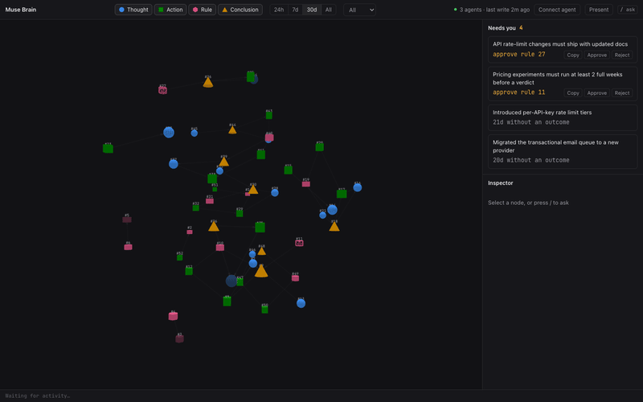
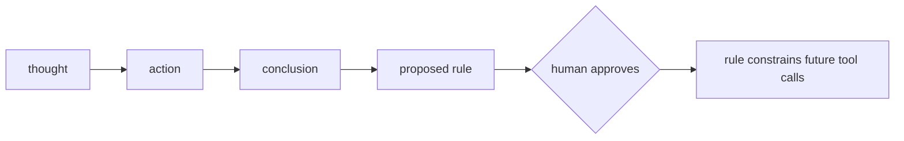
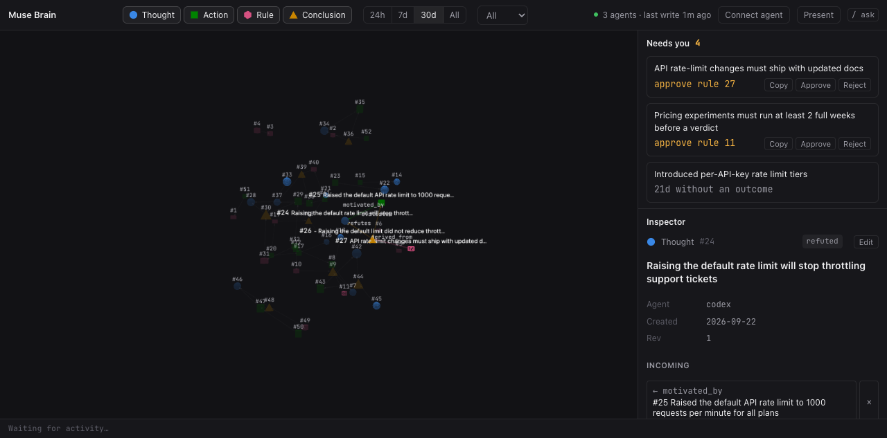
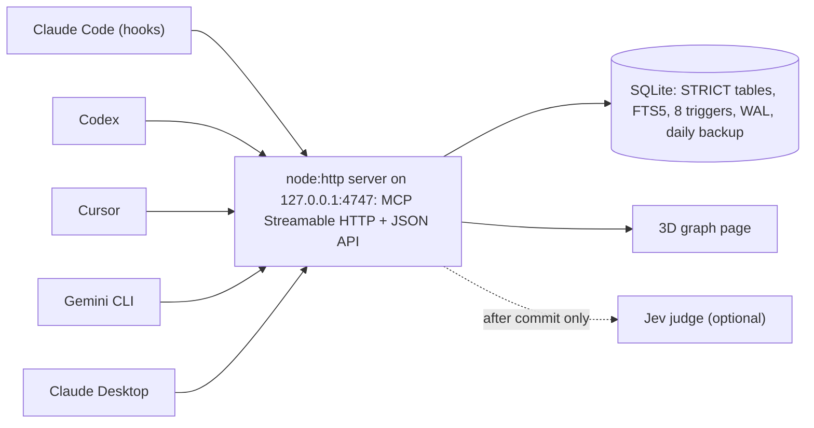
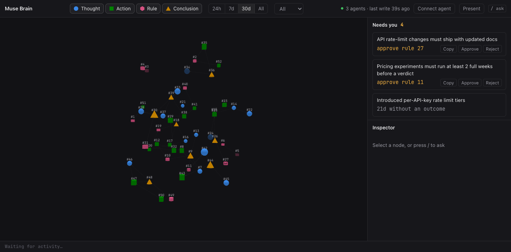

<h1 align="center">Muse Brain</h1>

<p align="center">
  <em>A brain for your agents, not a memory. Every decision with its why, every rule approved by a human, every outcome linked back to what caused it.</em>
</p>

<p align="center">
  <a href="https://github.com/yahavf6/muse-brain/actions/workflows/test.yml"></a>
  
  
  
  
  
</p>

<p align="center">
  
</p>

[Quickstart](#quickstart) | [How it compares](#how-it-compares) | [Roadmap](#roadmap)

## The thesis

Memory layers remember what was said. mem0 extracts facts from a conversation into a vector store. Zep and Graphiti build a temporal graph of episodes and entities. claude-mem compresses a coding session into flat observations. All of that is useful, and none of it captures why an agent did something, whether the decision turned out to be right, or what should never be tried again.

Muse Brain is a decision graph, not a memory. It keeps four kinds of node, an assumption, a real action, a rule and a conclusion, and connects them with nine typed edges that SQLite enforces with triggers, not with a prompt. An agent asks the brain before it acts, does the work in the real world, and logs one action with its why. When the outcome becomes known, a conclusion closes the loop back onto the action and onto whatever thought motivated it. A rule an agent proposes binds nothing until a human approves it; from that point it can deny, question, or quietly log a tool call before it runs.



Agents propose, humans approve; no model ever writes the record.

The author ran claude-mem for months before building this. Its store reached 101,485 observations, and because that shape has no outcome edges, not one of them could ever be linked back to the decision it came from. Closing that gap is what this project exists to do.

## Sixty seconds in the brain

An agent is about to touch the dashboard. Before it does, it asks:

```js
ask({ question: "have we decided anything about the dashboard's default sort order before?" })
```

```jsonc
{
  "intent": "history",
  "hits": [
    { "id": 18, "kind": "action", "title": "Changed dashboard default sort from name to most-recent", "status": null, "score": 0.88 },
    { "id": 11, "kind": "thought", "title": "Users miss new items because the dashboard sorts by name", "status": "validated", "score": 0.71 }
  ],
  "expanded": { /* one-hop neighbours of the hits */ },
  "jev": true, // true only with a TYPESAFE_API_KEY
  "footer": [
    "#12 has waited 21 days for an outcome. If you know it, log a conclusion that evaluates it."
  ]
}
```

It does the work, then logs one action with its why, its rejected alternatives, and a link back to what motivated it:

```js
log({
  kind: "action",
  title: "Reverted dashboard default sort back to name",
  why: "most-recent as default did not raise engagement over two weeks and confused returning users, see #18",
  alternatives: ["keep most-recent and add a persistent sort toggle", "A/B test both defaults instead of flipping outright"],
  files: ["apps/web/src/dashboard/SortControl.tsx"],
  links: [{ type: "motivated_by", to: 11 }],
})
```

```json
{
  "id": 41,
  "created": true,
  "links": 1,
  "footer": [
    "#12 has waited 21 days for an outcome. If you know it, log a conclusion that evaluates it.",
    "Possibly related: #18. Link if so."
  ]
}
```

Two weeks later the outcome is known. A conclusion closes the loop and refutes the thought that started it:

```js
log({
  kind: "conclusion",
  title: "Most-recent default did not raise engagement",
  verdict: "bad",
  links: [
    { type: "evaluates", to: 41 },
    { type: "refutes", to: 11 },
  ],
})
```

<p align="center">
  
</p>

The inspector on a refuted thought from the demo seed: status, agent, and its incoming edges. The agent proposes a rule so the mistake is not repeated:

```js
log({
  kind: "rule",
  title: "Never change a default sort order without an A/B test",
  why: "the most-recent default made things worse and nobody noticed for two weeks, see #41",
  status: "proposed",
  guard: { tool: "Edit|Write", deny_if: "defaultSort" },
  links: [{ type: "derived_from", to: 42 }],
})
```

The human, in chat: **"approve rule 43"**. Only then does the agent call:

```js
approve_rule({ id: 43, approved_by: "yahav" })
```

Next session, `SessionStart` injects the approved rule (company-wide here, since it was logged without a `project`), and the next time an `Edit` touches `defaultSort`, `PreToolUse` asks the server and the guard on rule #43 denies the call before it runs.

## What the graph holds

| kind | title is | required | status / verdict | edges out |
|---|---|---|---|---|
| `thought` | an assumption or idea | title | open, validated or refuted; confidence 0 to 1 | `derived_from` a conclusion |
| `action` | what was done in the real world | title, **why** | none | `motivated_by` a thought, `complies_with` a rule, `follows` an action |
| `rule` | one imperative sentence | title, **why** | proposed, approved or retired | `supersedes` a rule, `derived_from` a conclusion |
| `conclusion` | the lesson | title, verdict | good, bad or mixed | `evaluates` an action, `supports` or `refutes` a thought |

A decision is just an action with a why and rejected alternatives on record. Nodes are cited as `#id`, never deleted by agents, only retired (`valid_to` set) when superseded.

Nine legal edges, no others:

| edge | from kind | to kind | means |
|---|---|---|---|
| `derived_from` | thought | conclusion | this thought follows from that conclusion |
| `motivated_by` | action | thought | this action was motivated by that thought |
| `complies_with` | action | rule | this action complies with that approved rule |
| `follows` | action | action | this action follows that one |
| `supersedes` | rule | rule | this rule replaces that one |
| `derived_from` | rule | conclusion | this rule follows from that conclusion |
| `evaluates` | conclusion | action | this conclusion judges that action |
| `supports` | conclusion | thought | this conclusion validates that thought |
| `refutes` | conclusion | thought | this conclusion refutes that thought |

### Enforced by the database, not by prompts

- An edge must match one of the nine legal (type, source kind, destination kind) triples, or the write is rejected.
- `complies_with` only links to an approved, current rule.
- A new rule is always born `proposed`; nothing can insert one already `approved`.
- Approving a rule requires an `approved_by` value.
- `supersedes` retires the old rule only once the new one is itself approved.
- `supports` and `refutes` automatically flip the target thought to `validated` or `refuted`.
- `CHECK` constraints: actions and rules must carry a `why`; conclusions must carry a `verdict`; thought and rule statuses are closed sets.

## Philosophy

1. **Build thin, do not adopt.** gbrain, Basic Memory, Graphiti and mem0 were all evaluated and rejected for this job (ontology mismatch, no binding rules, an LLM on every write, or an AGPL license); their good ideas were kept, their weight was not.
2. **No model in the write path, ever.** Capture is deliberate: the agent logs, the hook nudges. What a model never wrote, a model can never hallucinate into the record.
3. **Invariants live in the store, not in prompts.** Four kinds, nine edges, eight invariant triggers (plus three that keep the FTS index in sync). A prompt can be ignored; a `CHECK` constraint cannot.
4. **Agents propose, humans approve.** A rule binds nothing until a person says so, about that specific rule, in the conversation. Agents can never delete a node or an edge.
5. **Every action carries its why.** A decision without its rejected alternatives is a fact; with them it is knowledge.
6. **Link everything.** Borrowed from gbrain's framing: an unlinked node is a broken brain. The `log` reply warns when a new node leaves with zero edges.
7. **Fail open, always.** If the server is down, hooks exit 0, approved rules still load straight from the database file, and work continues uninterrupted.
8. **One graph, every agent.** Claude Code, Codex, Cursor, Gemini CLI and Claude Desktop write to the same rows, each one stamped with who wrote it.
9. **Every visual encodes a fact.** Shape is kind, wireframe is not yet settled, position is time and connection; nothing on the page is decoration.

## How it compares

mem0, Zep and Graphiti, and the rest of the systems below are good, in several cases very good, at conversational recall: reconstructing a fact a user mentioned three sessions ago. Muse Brain does not attempt that job. It assumes an agent will ask before it acts, and it answers with why something was done, what rule constrains it, and what happened afterward, not with a verbatim quote pulled from a chat transcript.

| System | Unit of memory | LLM in write path | Typed edges enforced by store | Human-approved rules bind live tool calls | Outcome tied to the action it judges | Shared across Claude Code / Codex / Cursor / Gemini CLI / Claude Desktop | Storage, runtime deps | License |
|---|---|---|---|---|---|---|---|---|
| **Muse Brain** | 4 typed nodes: thought, action, rule, conclusion | No | Yes, 9 edges, DB triggers | Yes; regex guards deny, semantic guards shadow by default, Claude Code hooks only | Yes, `evaluates` edge | Yes, one MCP server (hooks: Claude Code only) | SQLite, 3 direct dependencies (6 packages installed) | PolyForm Noncommercial |
| mem0 | Flat text facts + vectors | Yes by default[^mem0-1] | Partial, optional graph memory of entities, not enforced[^mem0-2] | No | No, manual feedback API[^mem0-3] | Partial, scoping by `agent_id` / `app_id` | Vector DB, Qdrant default + 20 options | Apache-2.0 |
| Zep / Graphiti | Temporal fact graph: episodes, entities, edges[^zep-1] | Yes, `add_episode` extraction[^zep-2] | Typed by extraction (custom entity and edge types), not enforced by the store | No | No | Partial, group graphs, Zep ABAC | Neo4j / FalkorDB / Neptune (OSS); proprietary (Zep cloud) | Apache-2.0 (Graphiti) |
| Letta | Free-text memory blocks + vector passages | No separate extraction; the agent LLM writes, direct API writes need no LLM[^letta-1] | No, no graph | No, `read_only` blocks only | No | Yes, shared blocks / shared MemFS repos[^letta-2] | Postgres + pgvector; MemFS = git repo per agent | Apache-2.0 |
| claude-mem | Flat typed observation rows | Yes, Agent SDK worker on every `PostToolUse`[^cm-1] | No | No | No | Yes, same DB across harnesses | SQLite + FTS5, optional Chroma | Apache-2.0 |
| Basic Memory | Markdown notes + typed `[[wikilink]]` relations | No server-side LLM, client writes markdown[^bm-1] | Yes, typed relations | Partial, comment / suggestion review, not rules[^bm-2] | No | Yes, teams shared workspace | Markdown files + SQLite / Postgres index | AGPL-3.0 |
| gbrain | Typed pages + typed edges with provenance | No for edges; optional for extraction[^gb-1] | Yes | Partial, owner-approved OAuth, no rule queue | Partial, nightly dream cycle + contradiction eval[^gb-2] | Yes, scoped tokens, company-brain mode | Markdown repos + PGLite or Postgres + pgvector | MIT |
| Cognee | LLM-extracted knowledge graph + vectors | Yes, `cognify()`[^cog-1] | Yes, incl. `contradicts` edges | No | Partial, 1 to 5 feedback weights[^cog-2] | Partial, shared datasets and tenants | Kuzu + LanceDB + SQLite | Apache-2.0 |
| Supermemory | Temporal fact graph: updates / extends / derives | Yes, async extraction queue[^sm-1] | Yes | Partial, review queue for low-confidence inferred memories, not rules[^sm-2] | No | Yes, shared `containerTag` | Cloudflare Workers + Postgres / pgvector | MIT (repo); local binary capped at 10k docs[^sm-3] |
| Honcho | Peer representations: premises + conclusions | Yes, after the request commits[^ho-1] | No entity graph | No | No | Yes, native multi-peer | Postgres + pgvector, Redis | AGPL-3.0 |

[^mem0-1]: `infer=False` bypasses extraction; on by default. https://docs.mem0.ai/core-concepts/memory-operations/add
[^mem0-2]: Graph memory overview. https://docs.mem0.ai/open-source/graph_memory/overview
[^mem0-3]: Platform `feedback` API, manual. https://docs.mem0.ai/platform/features/feedback-mechanism
[^zep-1]: Bi-temporal context graph, Graphiti paper. https://arxiv.org/abs/2501.13956
[^zep-2]: `add_episode` runs LLM extraction. https://help.getzep.com/graphiti/configuration/llm-configuration
[^letta-1]: Direct archival-memory API writes need no LLM. https://docs.letta.com/guides/agents/archival-memory
[^letta-2]: MemFS, a git repo per agent. https://docs.letta.com/concepts/memfs
[^cm-1]: Architecture overview. https://docs.claude-mem.ai/architecture/overview
[^bm-1]: Knowledge format: notes + typed relations. https://docs.basicmemory.com/raw/concepts/knowledge-format.md
[^bm-2]: Comments and suggestions review. https://docs.basicmemory.com/raw/cloud/comments-and-suggestions.md
[^gb-1]: "Zero LLM calls" for edges; optional extraction. https://github.com/garrytan/gbrain#readme
[^gb-2]: Nightly dream cycle + contradiction eval. https://github.com/garrytan/gbrain-evals
[^cog-1]: `cognify()` calls an LLM. https://docs.cognee.ai/core-concepts/main-operations/cognify
[^cog-2]: `add_feedback` 1 to 5 updates `feedback_weight`. https://docs.cognee.ai/guides/feedback-system
[^sm-1]: Extracting, Chunking, Embedding queue. https://supermemory.ai/docs/how-it-works
[^sm-2]: Inferred-memory review, approve or decline. https://supermemory.ai/docs/recall/memory-review.md
[^sm-3]: Local server release notes. https://github.com/supermemoryai/supermemory/releases/tag/server-v0.0.7
[^ho-1]: The request never waits on an LLM; the deriver runs after. https://docs.honcho.dev/v3/documentation/core-concepts/architecture

### Measured

Synthetic decision graphs written through the real `log` verb (zod validation, `BEGIN IMMEDIATE`, content hash, FTS triggers, edge triggers, reply footer), then 200 samples of each read verb. Jev was off for this run, so no network round trip; with a `TYPESAFE_API_KEY` set, `log` and `ask` each add one Jev call, up to 1.5 s and 2.5 s budgets respectively. Latencies in milliseconds. Full notes in [`bench/results-2026-09-22.md`](bench/results-2026-09-22.md).

| Nodes | log p50 | log p95 | writes/s | ask p50 | ask p95 | search p50 | context p50 | get p50 | DB MB | cold open |
|---|---|---|---|---|---|---|---|---|---|---|
| 1,000 | 0.17 | 0.26 | 5,067 | 0.37 | 0.56 | 0.12 | 0.08 | 0.03 | 0.7 | 0.41 |
| 10,000 | 0.17 | 0.27 | 4,720 | 1.23 | 3.02 | 0.67 | 0.10 | 0.03 | 6.3 | 0.45 |
| 100,000 | 0.18 | 0.28 | 3,818 | 9.51 | 27.0 | 7.48 | 0.11 | 0.03 | 64.3 | 0.53 |

Hook overhead (`PreToolUse` end to end, bash plus jq plus curl to the live server, 20 runs): p50 238 ms, p95 266 ms.

`context` and `get` stay flat because they are index walks from a known id. Every write still pays for zod validation, the transaction, the content-hash lookup, FTS index maintenance and the indexed outcome-gate lookup. Writing the bench caught and fixed two real bugs: the outcome-gate query and the Needs-you query both used `julianday()` arithmetic SQLite could not index, a full table scan per call, now a partial index; and link-suggestion candidates were computed even when Jev was off, now skipped.

Machine: Apple M4 Pro, 48 GB, macOS 26.6.2, Node 24.11.1, 2026-09-22. Reproduce with `npm run bench` (1k / 10k / 100k by default; 1M via `BENCH_SIZES`, expect hours).

### Why there is no LoCoMo score here

Muse Brain is a decision graph, not a chat-recall system, so LoCoMo and LongMemEval measure something it does not attempt: reconstructing facts from a long conversation. Those benchmarks also have real problems. [An independent audit](https://github.com/dial481/locomo-audit) found 6.4% of LoCoMo's golden answers corrupted, capping any system near 93.6%. [Judge choice alone swings identical answers from 32% to 84%](https://github.com/MemPalace/mempalace/issues/29). [mem0 and Zep have disputed each other's LoCoMo numbers for over a year](https://github.com/getzep/zep-papers/issues/5), still unresolved. And [a third-party, cost-aware run](https://arxiv.org/html/2601.07978v4) found plain RAG at $0.65 beating two graph-based systems that cost several times more; the same run had mem0 at 81.08% above the RAG baseline's 78.31%, so the point is cost and variance, not that graphs lose. None of that says graph memory is bad; it says a recall leaderboard is not the yardstick for a system built to hold why, not what was said.

<details>
<summary>Published recall numbers of the systems above</summary>

| System | LoCoMo | LongMemEval | Notes |
|---|---|---|---|
| mem0 | [Self-reported](https://arxiv.org/abs/2504.19413): 66.88 to 68.44 (gpt-4o-mini)<br>[Self-reported](https://mem0.ai/blog/mem0-the-token-efficient-memory-algorithm): 92.5 (2026, model/judge undisclosed)<br>[Third-party](https://arxiv.org/html/2601.07978v4): 81.08% at $5.43 (plain RAG baseline: 78.31% at $0.65) | [Self-reported](https://mem0.ai/blog/mem0-the-token-efficient-memory-algorithm): 94.4 (2026)<br>[Third-party](https://agentmemorybenchmark.ai/dataset/longmemeval): 67.6% GPT-4o | [Third-party](https://arxiv.org/abs/2602.01313) EverMemBench 37.09%; paper search p50 0.148s, ~7k tokens/conv |
| Zep / Graphiti | [Self-reported](https://blog.getzep.com/lies-damn-lies-statistics-is-mem0-really-sota-in-agent-memory/): 75.14%<br>[Self-reported](https://www.getzep.com/research/): 94.7% (gpt-5.4 reader+judge, 2026, no code linked)<br>[Third-party](https://arxiv.org/html/2601.07978v4): OSS Graphiti 56.03% at $6.95 | [Self-reported](https://arxiv.org/abs/2501.13956): 71.2% gpt-4o vs 60.2% full-context<br>[Self-reported](https://www.getzep.com/research/): 90.2% gpt-5.4 (2026) | [Third-party](https://arxiv.org/abs/2602.01313) EverMemBench 39.97%; 2026 p50/p95 87ms/155ms |
| Letta | [Self-reported](https://www.letta.com/blog/benchmarking-ai-agent-memory/): 74.0% (gpt-4o-mini, filesystem tools only) | none found | [Self-reported](https://arxiv.org/abs/2310.08560) DMR 93.4% GPT-4-turbo, a near-saturated benchmark |
| claude-mem | none found | none found | |
| Basic Memory | [Self-reported](https://github.com/basicmachines-co/basic-memory-benchmarks/blob/main/benchmarks/results/matrix-v2-summary.md): QA 0.439 to 0.641 (q300 subset) | [Self-reported](https://github.com/basicmachines-co/basic-memory-benchmarks/blob/main/benchmarks/results/matrix-v2-summary.md): QA 0.583 vs mem0-local 0.450 (60-q subset) | |
| gbrain | none found | [Self-reported](https://github.com/garrytan/gbrain-evals/blob/main/docs/benchmarks/2026-09-06-longmemeval-ranker-wave.md): QA 86.6% with reader (2026) | [Third-party](https://github.com/tenurehq/precisionMemBench) PrecisionMemBench 34/77 pass, p50 544ms |
| Cognee | [Third-party](https://arxiv.org/html/2601.07978v4): 55.27% at $2.99<br>[Third-party](https://agentmemorybenchmark.ai/dataset/locomo): AMB 80.3% on 152 queries | none found | |
| Supermemory | [Self-reported](https://github.com/supermemoryai/supermemory/issues/795): 77.1 (GPT-4o, reported in a GitHub issue) | [Self-reported](https://supermemory.ai/research/longmembench/): 95% (Recall@15, not QA); judged 84.6% gpt-5<br>[Third-party](https://arxiv.org/abs/2512.12818): 81.6% | |
| Honcho | [Self-reported](https://plasticlabs.ai/blog/research/Benchmarking-Honcho): 89.9% (Claude Haiku 4.5, judge undisclosed) | [Self-reported](https://plasticlabs.ai/blog/research/Benchmarking-Honcho): 90.4% (Haiku 4.5) | |

Every headline number above is vendor-run on a vendor-chosen model and judge stack unless marked third-party. `agentmemorybenchmark.ai` is operated by Vectorize, the vendor of a competing product (Hindsight).

</details>

## Architecture



### Verbs (8 over MCP + the JSON API, 2 UI-only)

| verb | what | exposed |
|---|---|---|
| `ask` | plain-language question; ranked `#id` hits plus one-hop context | MCP + API |
| `search` | structured lookup by kind, status, verdict, project, optional full-text | MCP + API |
| `context` | the neighborhood of a node, up to N hops, capped at 25 nodes | MCP + API |
| `get` | one or more nodes by id, with their edges | MCP + API |
| `log` | write a node with why, props, links; returns id, created flag, footer | MCP + API |
| `link` | add a typed edge between two existing nodes | MCP + API |
| `update` | change title, why, status, confidence, props or project with a `rev` check (verdict and guard are admin-only) | MCP + API |
| `approve_rule` | proposed to approved, with `approved_by`; only after a human said so | MCP + API |
| `delete_node`, `delete_edge` | hard delete | UI only, never an MCP tool; agents cannot delete |

### Hooks (Claude Code only, everything fails open with exit 0)

| hook | mode | does |
|---|---|---|
| `SessionStart` | `start` | injects approved rules scoped to this repo, reads the DB directly, works with the server down |
| `UserPromptSubmit` | `recall` | up to 3 related `#id` lines for the prompt, silent when nothing matches |
| `PreToolUse` | `pre` | one call to the server: regex guards, then semantic guards, then file-touch advice; deny, ask or allow |
| `PostToolUse` | `mark` | notes that a real-world call happened (commit, send, deploy, `mcp__*`) so `Stop` can nudge once |
| `Stop` | `stop` | nudges exactly once per session to `log` the action with its why |

`bash hooks/brain-hook.sh --selftest` runs fixtures for `start`, `pre`, `mark` and `stop`. The `curl` itself runs in well under a millisecond on loopback; the hook invocation is dominated by process spawn (bash, jq, curl), see the bench table above.

> **Jev**, the optional judge (TypeSafe System One), only decorates replies after a write has already committed: `ask` ranking, recall rerank, semantic guards, link suggestions. It returns `null` on a missing key, a timeout, a non-2xx response or bad JSON, and never throws and never blocks the commit; the `log` reply does wait up to 1.5 s for link suggestions when a key is set. Without `TYPESAFE_API_KEY` everything still works off FTS5 and bm25.

## Quickstart

### Requirements

- macOS for the background service (`launchd`); the server itself runs anywhere Node 24 does
- Node >= 24 on `PATH` (`node:sqlite`, type stripping, `process.loadEnvFile`)
- `sqlite3`, `jq`, `curl` on `PATH`

### Run it

```bash
git clone https://github.com/yahavf6/muse-brain.git && cd muse-brain
npm install
npm start
```

Open `http://127.0.0.1:4747`. `npm start` runs `src/server.ts` directly: no build step.

### See it with data

```bash
npm run seed
```

Writes a fictional B2B SaaS story ("Lumen"): a pricing toggle, an email queue migration, an onboarding wizard, API rate limits, a support auto-reply. 52 nodes, 51 edges, all nine edge types, two rules left `proposed` so the Needs-you panel has something to approve, everything scoped `project: 'demo'` so it can never bind real work. Refuses to run against a non-empty database; pass `--force` to seed anyway, or point it at a scratch file instead: `BRAIN_DB=/tmp/mb-demo.db npm run seed`.

### Connect an agent, one click

Open the page, click **Connect agent**, then **Install** next to a client. It writes that client's MCP config file (Claude Code's `~/.claude.json`, Codex's `~/.codex/config.toml`, Cursor's `~/.cursor/mcp.json`, Gemini CLI's `~/.gemini/settings.json`, Claude Desktop's config via `mcp-remote`). For Claude Code it also writes the five hook groups into `~/.claude/settings.json` and a `~/.claude/skills/brain` symlink. For Codex it also writes a `~/.agents/skills/brain` symlink and a short "Company brain" block appended to `~/.codex/AGENTS.md`. For Gemini CLI it also appends that same block to `~/.gemini/GEMINI.md`. It backs up any file it touches first as `<file>.bak-brain-<timestamp>`. A client that is already wired up is left untouched: no write, no backup.

### Connect an agent, by hand

Same wiring, run yourself. The server name must stay `brain` (a hook regex depends on it); each client points at `http://127.0.0.1:4747/mcp?agent=<name>`.

**Claude Code**
```bash
claude mcp add --scope user --transport http brain "http://127.0.0.1:4747/mcp?agent=claude-code"
```

**Codex CLI + ChatGPT desktop**, add to `~/.codex/config.toml`:
```toml
[mcp_servers.brain]
url = "http://127.0.0.1:4747/mcp?agent=codex"
```

**Cursor**, add to `~/.cursor/mcp.json`:
```json
{ "mcpServers": { "brain": { "url": "http://127.0.0.1:4747/mcp?agent=cursor" } } }
```

**Gemini CLI**, add to `~/.gemini/settings.json`:
```json
{ "mcpServers": { "brain": { "url": "http://127.0.0.1:4747/mcp?agent=gemini-cli", "type": "http" } } }
```
Verify these two key names against current Cursor and Gemini CLI docs before relying on them: they move.

**Claude Desktop**, no native HTTP MCP support, bridged through `mcp-remote`:
```json
{ "mcpServers": { "brain": { "command": "npx", "args": ["mcp-remote", "http://127.0.0.1:4747/mcp?agent=claude-desktop"] } } }
```

### Claude Code hooks

Back up `~/.claude/settings.json` first. **Append** these to the arrays under `"hooks"`, do not replace what is already there:

```json
{
  "hooks": {
    "SessionStart": [{ "hooks": [{ "type": "command", "command": "bash <repo>/hooks/brain-hook.sh start", "timeout": 5 }] }],
    "UserPromptSubmit": [{ "hooks": [{ "type": "command", "command": "bash <repo>/hooks/brain-hook.sh recall", "timeout": 5 }] }],
    "PreToolUse": [{ "matcher": "Bash|Edit|Write|MultiEdit|NotebookEdit|mcp__.*", "hooks": [{ "type": "command", "command": "bash <repo>/hooks/brain-hook.sh pre", "timeout": 5 }] }],
    "PostToolUse": [{ "matcher": "Bash|mcp__.*", "hooks": [{ "type": "command", "command": "bash <repo>/hooks/brain-hook.sh mark", "timeout": 5 }] }],
    "Stop": [{ "hooks": [{ "type": "command", "command": "bash <repo>/hooks/brain-hook.sh stop", "timeout": 5 }] }]
  }
}
```

Replace `<repo>` with the path you cloned into. Hooks for Codex, Cursor and Gemini CLI are on the roadmap; today those agents get the MCP tools and the skill below, no hooks.

### Skill, all agents

```bash
ln -s <repo>/skills/brain ~/.claude/skills/brain
ln -s <repo>/skills/brain ~/.agents/skills/brain
```

For agents without hooks (Codex, Gemini CLI, Cursor), add this pointer to `~/.codex/AGENTS.md` and `~/.gemini/GEMINI.md`:

```
Muse Brain (MCP server `brain`) is this machine's shared decision log. Before a task or any outbound or irreversible call, call `ask`; after real-world work, call `log` once with kind=action and a why.
Approved rules bind you: call `search(kind: rule, status: approved)` at the start of a session and obey what comes back.
See the `brain` skill for the 4 node kinds, the edge vocabulary, and worked `log` examples.
```

### Always-on service

```bash
bash scripts/service.sh install     # renders the plist with your node + repo paths, bootstraps and starts it
bash scripts/service.sh status      # launchctl print, plus a version check
bash scripts/service.sh restart
bash scripts/service.sh uninstall
```

Label is `ai.musebrain.brain`. `render` prints the plist without installing it, useful for checking what it will write.

### Env file

`~/.brain/.env`, `chmod 600`, loaded automatically at server start:

```
TYPESAFE_API_KEY=sk-...      # optional; absent = Jev off, FTS only
BRAIN_JEV=off                # disable Jev while keeping a key
BRAIN_JEV_GUARDS=shadow      # shadow | on | off
BRAIN_GUARDS=off             # kill switch for all guards
```

Also read: `BRAIN_PORT` (default 4747), `BRAIN_DB` (default `~/.brain/brain.db`), `BRAIN_LOG_DIR` (default `~/.brain/logs`).

## Rules and guards

<p align="center">
  
</p>

A rule is born `proposed`. It binds nothing until a human approves it, either in chat ("approve rule #21") or with the Approve button in the Needs-you panel shown above. Approved rules are injected at session start, scoped either company-wide (`project` is `NULL`) or to one repo.

A rule can carry a `guard` in its props: a regex over the tool name and, optionally, a regex over the tool input (`deny_if`), or a yes/no question for the semantic judge (`judge`). Regex guards deny immediately on a match. Semantic guards use Jev score bands: 0.85 and above denies, 0.5 to 0.85 asks, below that allows.

`BRAIN_JEV_GUARDS=shadow` is the default: a semantic guard logs what it would have done, to `~/.brain/logs/guard.log` as JSONL, without actually blocking anything. Flip it to `on` once you trust it. `BRAIN_GUARDS=off` in `~/.brain/.env` is the kill switch for every guard, regex and semantic alike, read by both the hook and the server.

## Roadmap

**Next**

- [ ] V2 cloud agents: public HTTPS (Cloudflare Tunnel or a VPS), hashed bearer tokens, a REST + OpenAPI mirror generated from the verb table
- [ ] Hooks for Codex, Cursor and Gemini CLI (today: MCP tools and the skill only)
- [ ] Migration tool: claude-mem observations and Claude Code `MEMORY.md` files, into typed nodes

**Later**

- [ ] Nullable `embedding` column and vector search (FTS5 plus optional Jev rerank covers precision today)
- [ ] Calibration: Brier scoring of thought confidence against actual outcomes
- [ ] Nightly consolidation and contradiction detection (Jev: supports, contradicts, or says nothing)
- [ ] A CLI
- [ ] A Linux service (systemd unit; launchd only today)
- [ ] A Postgres backend (the schema ports near verbatim)
- [ ] A Graphify sidecar: a code map joined to decisions via `node_file`, never in the write path
- [ ] A change feed and clustering on the page past roughly 2,000 nodes (today: a full refetch of the visible slice)

Not on the roadmap: an LLM in the write path.

## Status and limits

- v1, first commit 2026-09-22, used daily by its author across five agents.
- Loopback trust model: any local process that sends the right `Host` header can call `/api/call` (admin scope) and `/api/install`. Tokens are a V2 item.
- Guards enforce only in Claude Code, the only client with hooks today.
- The background service is macOS-only; the server itself runs anywhere Node 24 does.
- Present-mode labels can overlap on dense clusters.
- A hard delete from the page does not undo trigger side effects that already happened (for example, a rule this node had retired via `supersedes` stays retired).

## Development

```bash
npm test                              # 85 tests, node:test, no framework
bash hooks/brain-hook.sh --selftest   # hook fixtures for start, pre, mark, stop
npm run bench                         # synthetic graphs through the real log() verb, 1k / 10k / 100k nodes (1M opt-in via BENCH_SIZES)
```

```
src/          server, verbs, schema, judge, install
hooks/        brain-hook.sh (Claude Code hooks, --selftest)
public/       index.html, the 3D graph page, no build step
skills/brain/ SKILL.md, the agent-facing protocol
scripts/      seed-demo.ts, service.sh
bench/        run.ts, synthetic-graph benchmarks
docs/         contracts.md, design.md, media/
test/         brain.test.ts, install.test.ts (node:test)
```

Further reading: [`docs/contracts.md`](docs/contracts.md) (the wire format: every verb signature, endpoint, env var), [`docs/design.md`](docs/design.md) (the original internal design note, kept as history), [`skills/brain/SKILL.md`](skills/brain/SKILL.md) (the agent-facing protocol), [`DESIGN.md`](DESIGN.md) (design-system tokens recorded from the built page).

## Troubleshooting

- Logs: `~/.brain/logs/server.log` (server), `~/.brain/logs/hook.log` (hooks always fail open, check here first if a hook seems silent), `~/.brain/logs/guard.log` (every guard decision, JSONL), `~/.brain/logs/launchd.log` (service stdout/stderr).
- Hook doing nothing? Run `bash hooks/brain-hook.sh --selftest`: it should print all `PASS`.
- Kill switch for guards without touching rules: set `BRAIN_GUARDS=off` in `~/.brain/.env`, both the hook and the server read it from there.
- `BRAIN_DB` overrides the database path, useful for the selftest or for pointing at a scratch database.
- Service not starting: `launchctl print gui/$(id -u)/ai.musebrain.brain` and check `~/.brain/logs/launchd.log`.

## License

Muse Brain is source-available under the [PolyForm Noncommercial License 1.0.0](LICENSE). Any noncommercial purpose is permitted, including personal use, research, education, and use by nonprofits and government institutions. Any commercial use requires a separate license from the author.

## Acknowledgements

[gbrain](https://github.com/garrytan/gbrain) for the "link everything" framing and the company-brain idea. [Graphiti](https://github.com/getzep/graphiti) for temporal edge ideas. [Basic Memory](https://github.com/basicmachines-co/basic-memory) for markdown-first restraint. [3d-force-graph](https://github.com/vasturiano/3d-force-graph) for the page. TypeSafe Jev for the optional judge. The [Model Context Protocol](https://modelcontextprotocol.io) for the wire format every agent here speaks.
